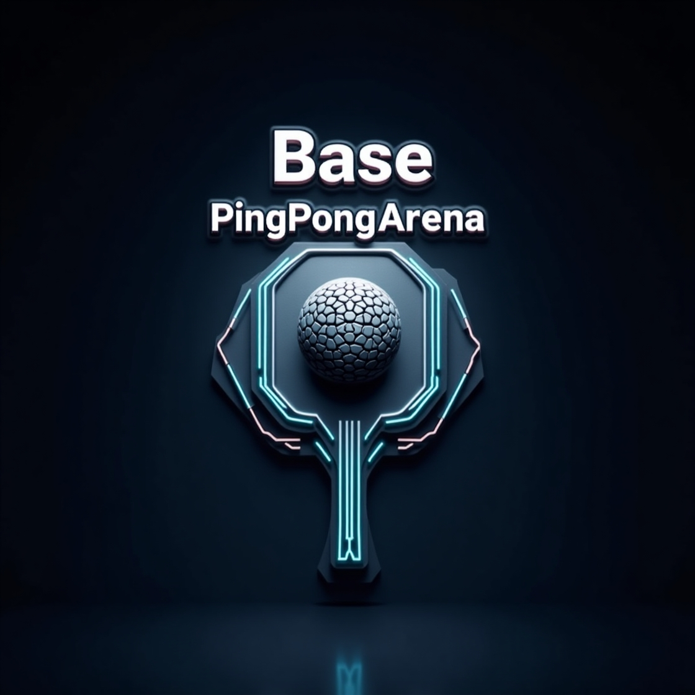

# 🚀 Base PingPong Arena

> Where blockchain meets competitive gaming - stake ETH, battle opponents, collect NFTs with real utility, and climb the leaderboard in this Web3 arcade revolution on Base chain.

---

## 📌 Problem Statement

**Problem Statement: Create an engaging blockchain game leveraging Base's high-performance smart contract platform for the Base Hackathon**

---

## 🎯 Objective

Base PingPong Arena bridges the gap between traditional gaming and Web3 by creating an intuitive, skill-based game with meaningful digital ownership. It solves the problem of disconnected gaming experiences by introducing NFTs with actual utility, verifiable match results, and fair competition mechanics.

The project serves both traditional gamers looking for new experiences and crypto enthusiasts seeking engaging applications beyond speculation. By implementing a balanced economy with peer-to-peer trading and skill-based rewards, it demonstrates Base's capabilities for gaming applications through fast transactions, low fees, and scalable smart contracts.

This project is submitted for the Entertainment track of the Base Hackathon, creating a consumer-facing gaming application that leverages Base's infrastructure.

---

## 🧠 Myself & Approach

### Solo Developer:
- Arpit Patel

### My Approach:
- **Why I chose this problem**: Gaming represents one of the most promising adoption vectors for blockchain technology. By creating an engaging, skill-based game with meaningful NFT integration, I can demonstrate Base's capabilities while providing genuine value to users.

- **Key challenges addressed**:
  - Implementing real-time P2P multiplayer without a dedicated server
  - Creating NFTs with actual gameplay utility rather than just cosmetics
  - Designing a fair competition system with verifiable results
  - Building an intuitive UI that appeals to both traditional gamers and crypto users
  - Migrating from another chain to Base to leverage its performance and ecosystem

- **Breakthroughs during development**:
  - Developed a hybrid approach for game result verification that balances on-chain integrity with user experience
  - Created an efficient attribute encoding system for on-chain NFT metadata
  - Implemented a fair admin verification system for match results with actual score display
  - Successfully migrated the entire application to Base chain while maintaining all functionality

---

## 🛠️ Tech Stack

### Core Technologies Used:
- **Frontend**: React, TypeScript, TailwindCSS, Vite
- **Blockchain**: Solidity, ethers.js
- **Real-time Multiplayer**: PeerJS (WebRTC)
- **Storage**: On-chain storage for game results as well as for NFT metadata
- **Hosting**: Vercel

### Sponsor Technologies Used:
- [✅] **Base:** Smart contracts for game creation, joining, NFT minting and marketplace functionality. Implemented on-chain storage for game results, NFT metadata, and player statistics.

---

## ✨ Key Features

- ✅ **Real-time Multiplayer Ping Pong Game**: Smooth, responsive gameplay with P2P connection using WebRTC

- ✅ **NFT Integration with Gameplay Utility**:
  - Paddle NFTs with attributes (power, spin control, durability)
  - Player avatar NFTs with cosmetic and utility features
  - Visual effect NFTs (trails, ball skins) with on-chain metadata

- ✅ **Blockchain-Verified Match Results**:
  - Transparent match history with verifiable outcomes
  - Admin verification system showing actual game scores
  - Fair winner declaration mechanism

- ✅ **NFT Marketplace**: Buy, sell, and trade game assets with other players

- ✅ **Stake-Based Competitive Play**: Stake ETH on matches for added excitement



*The game features an attractive UI with real-time responsive controls, and blockchain integration.*

---

## 📽️ Demo & Deliverables

- **Demo Video Link:** [Base Ping Pong Arena Demo (Youtube)](https://youtu.be/your-video-id)
- **Live Demo:** [Deployed Link](https://base-ping-pong-arena.vercel.app)
- **Explorer Link:** [Contract Address (View on Basescan)](https://basescan.org/address/0x661D8753e6909EbbBeB0bd2551A0418b530eF1DF)
- **GitHub Repository:** [Base PingPong Arena](https://github.com/arpit15006/Base-PingPong-Arena)
---

## ✅ Base Hackathon Submission

This project is submitted for the **Entertainment** track of the Base Hackathon. It meets the following requirements:

- [✅] **Functioning onchain app at a publicly accessible URL**
- [✅] **Open-source GitHub repository with all source code**
- [✅] **Video demo with introduction, demonstration, problem statement, solution, and architecture overview**
- [✅] **Integration with Base chain for all blockchain functionality**
- [✅] **Proof of deployment and transactions on Base mainnet** - Contract deployed and verified at [0x661D8753e6909EbbBeB0bd2551A0418b530eF1DF](https://basescan.org/address/0x661D8753e6909EbbBeB0bd2551A0418b530eF1DF) with [successful transaction](https://basescan.org/tx/0xfb6e6e154e76373a28cbfd5930003564a20d87e2d821490d7700af22c1ac83ce)

---

## 🧪 How to Run the Project

### Requirements:
- Node.js v16+ and npm
- MetaMask, Coinbase Wallet, or another Ethereum wallet with Base configured
- ETH on Base for transactions

### Local Setup:
```bash
# Clone the repo
git clone https://github.com/your-username/Base-PingPong-Arena.git

# Install dependencies
cd Base-PingPong-Arena
npm install

# Start development server
npm run dev
```

### Connecting to Base:
1. Add Base to your wallet:
   - **Base Mainnet**: Chain ID: 8453, RPC URL: https://mainnet.base.org
   - **Base Sepolia Testnet**: Chain ID: 84532, RPC URL: https://sepolia.base.org
2. Get ETH on Base (through Coinbase or a bridge from Ethereum)
3. Connect your wallet to the application

### Smart Contract Deployment:
```bash
# Create a .env file with your private key and API keys (see .env.example)
cp .env.example .env
# Edit the .env file with your details

# Deploy to Base Sepolia Testnet
npx hardhat run scripts/deploy-base.cjs --network baseTestnet

# Deploy to Base Mainnet
npx hardhat run scripts/deploy-base.cjs --network base

# Verify contract on Basescan (replace with your contract address)
npx hardhat verify --network base 0x661D8753e6909EbbBeB0bd2551A0418b530eF1DF
```

---

## 🧬 Future Scope

- 🎮 **Enhanced Gameplay Mechanics**: Add power-ups, different game modes, and tournaments
- 🏆 **Tournament System**: Implement bracket-based tournaments with prize pools
- 🌐 **Cross-Chain Compatibility**: Allow NFTs to be used across different blockchain games
- 📱 **Mobile Application**: Develop native mobile apps for iOS and Android
- 🤝 **Social Features**: Add friends, messaging, and team play options
- 🔄 **NFT Crafting System**: Combine NFTs to create more powerful or unique items

---

## 📎 Resources / Credits

- **PeerJS**: WebRTC library for peer-to-peer connections
- **ethers.js**: Ethereum library for blockchain interactions
- **Base Chain**: For blockchain infrastructure and smart contract deployment
- **Coinbase Wallet**: For seamless wallet integration
- **Hardhat**: For smart contract development and deployment
- **Base Documentation**: For guidance on Base chain integration

---

## 🏁 Final Words

Building Base PingPong Arena has been an exciting journey into the intersection of gaming and blockchain technology. The most rewarding aspect was creating a system where players can stake their ETH and compete for real rewards, all while owning and trading unique NFTs on the Base chain.

The biggest challenge was implementing a fair and transparent match result verification system that balances on-chain integrity with user experience. By developing a hybrid approach with admin verification showing actual game scores, I've created a solution that maintains the benefits of blockchain while addressing its limitations.

Migrating the project to Base chain was a smooth process thanks to Base's EVM compatibility and excellent developer tools. The Base ecosystem provides the perfect infrastructure for gaming applications with its fast transaction speeds, low fees, and growing user base.

I believe this project demonstrates the potential of Base for gaming applications and hope it inspires more developers to build engaging, skill-based games on the blockchain. The Base Hackathon has been a great opportunity to showcase how traditional gaming experiences can be enhanced through blockchain technology.

---
